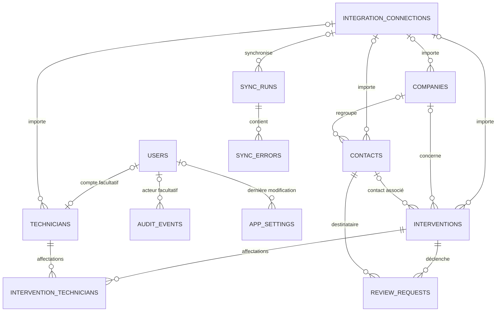

# Modèle de données V2

## Choix techniques

PostgreSQL est retenu pour ses contraintes relationnelles, ses transactions, `jsonb`, ses index et ses dates avec fuseau horaire. Drizzle décrit le schéma en TypeScript et génère des migrations SQL lisibles : le modèle reste typé sans masquer ce que PostgreSQL exécutera.

Cette étape ne contient aucun pilote PostgreSQL, client de base de données ou appel réseau. `drizzle-orm` fournit le schéma et les types ; `drizzle-kit`, utilisé uniquement en développement, génère et contrôle les migrations.

## Relations principales



Une intervention peut n’avoir aucune ligne dans `intervention_technicians`, ou en avoir plusieurs. La clé primaire composée interdit seulement de rattacher deux fois le même technicien à la même intervention ; aucun technicien principal n’est inventé.

## Rôle des tables

- `users` : futurs comptes Yooza Avis et rôles applicatifs, sans authentification à ce stade.
- `integration_connections` : connexions logiques à un fournisseur externe, sans secret, token ni configuration OAuth.
- `technicians` : techniciens terrain, éventuellement reliés à un compte utilisateur.
- `companies` : identité minimale d’une société cliente.
- `contacts` : destinataires potentiels des demandes d’avis, éventuellement liés à une société.
- `interventions` : événements Yooza issus d’une source externe ou d’une saisie future.
- `intervention_technicians` : relation plusieurs-à-plusieurs entre interventions et techniciens.
- `review_requests` : cycle de vie indépendant d’une demande d’avis et clé d’idempotence.
- `sync_runs` : résumé d’une future exécution de synchronisation.
- `sync_errors` : erreurs sûres rattachées à une synchronisation, sans token ni payload brut.
- `audit_events` : événements applicatifs avec métadonnées JSON minimales et non sensibles.
- `app_settings` : réglages JSON non sensibles ; les secrets n’y ont pas leur place.

## Connexions et identifiants externes

`integration_connections` représente une connexion logique à un fournisseur tel que Teamleader. Elle ne contient aucun secret. Une connexion utilisée est normalement désactivée avec `active = false` ; les clés étrangères en `RESTRICT` empêchent sa suppression tant que des entités ou synchronisations y font référence.

`technicians`, `companies` et `contacts` utilisent les colonnes génériques `integration_connection_id` et `external_id`. Une contrainte impose que les deux soient simultanément renseignées ou simultanément absentes. Un index unique partiel sur `(integration_connection_id, external_id)`, limité aux lignes renseignées, permet à deux connexions différentes de posséder le même `external_id` sans collision.

`interventions` utilise également l’index unique partiel `(integration_connection_id, external_id)` pour les objets rattachés à une connexion. Pour les objets sans connexion mais disposant d’un identifiant historique, un second index unique partiel porte sur `(external_source, external_id)` lorsque `integration_connection_id IS NULL`. Les interventions manuelles peuvent conserver un `external_id` nul.

`sync_runs` référence facultativement la connexion exécutée et conserve `source` comme information historique. La cohérence entre `source`, `external_source` et le `provider` d’une connexion sera contrôlée par le futur service applicatif ; aucune contrainte SQL inter-table implicite n’est ajoutée à ce stade.

Teamleader restera la source de vérité de ses données lorsque la synchronisation en lecture seule sera conçue. Yooza Avis sera la source de vérité des demandes d’avis, de leur idempotence, de l’audit et des réglages applicatifs. La règle qui déterminera qu’une intervention Teamleader est terminée reste volontairement non définie ; le statut `unknown` permet de ne pas l’inventer.

## Contraintes et suppressions

- Les rôles et statuts sont des enums PostgreSQL.
- Les compteurs de demandes et synchronisations ne peuvent pas être négatifs.
- `ended_at` ne peut pas précéder `started_at`, et `finished_at` ne peut pas précéder le début d’une synchronisation.
- Les e-mails utilisateurs sont uniques et doivent être normalisés en minuscules.
- Les e-mails utilisateurs, clés d’idempotence et clés de réglages doivent être sans espaces périphériques ; les e-mails et clés de réglages doivent être en minuscules.
- `idempotency_key` est obligatoire, non vide, normalisée, sensible à la casse et unique.
- `contacts.review_opt_out` est obligatoire et cohérent avec `review_opt_out_at`. Le statut `do_not_contact` reste disponible sur la demande comme historique.
- Le futur service devra revérifier l’opt-out avant la création, la programmation et l’envoi d’une demande d’avis. Aucune logique RGPD complète ni aucun trigger n’est ajouté ici.
- Les liens facultatifs vers un utilisateur, une société ou un contact utilisent `SET NULL` afin de conserver les faits historiques.
- Les demandes d’avis, affectations de techniciens et erreurs de synchronisation utilisent `RESTRICT` : leur parent ne peut pas être supprimé accidentellement.
- Aucun `ON DELETE CASCADE` n’est utilisé. Les entités disposant de `active` doivent normalement être désactivées plutôt que supprimées.

Une politique séparée d’anonymisation et de rétention devra être définie avant production pour répondre aux besoins RGPD sans détruire l’historique nécessaire.

## Index utiles

- interventions par société/date et par statut/date de fin ;
- demandes d’avis par intervention et par statut/date planifiée ;
- identifiants externes par connexion, identifiants historiques sans connexion et clé d’idempotence ;
- synchronisations par connexion/date et par source/date ;
- synchronisations par source/date ;
- erreurs par synchronisation ;
- audit par date et par type/date ;
- affectations par technicien et contacts par société.

Les index restent limités aux consultations et contrôles d’unicité prévisibles à ce stade.

## Dates et timezone

Toutes les dates serveur sont des `timestamp with time zone`. PostgreSQL les normalise ; l’interface pourra les afficher dans `Europe/Brussels`. Aucun horaire métier critique n’est stocké comme simple chaîne.

Les colonnes `created_at` et `updated_at` des tables modifiables sont `NOT NULL` avec `DEFAULT now()`. Ce défaut initialise `updated_at` lors de l’insertion mais ne le modifie pas automatiquement lors d’un `UPDATE`. Aucun trigger n’est installé : le futur repository ou service applicatif devra toujours mettre `updated_at` à jour lors d’une modification.

## Convention de migration

Le dossier `drizzle/` contient les migrations générées et leurs métadonnées. La première migration est `0000_initial_schema.sql`. Tant qu’elle n’est pas publiée, elle peut être régénérée avec le schéma ; après publication, elle devient immuable et toute évolution doit créer une migration numérotée suivante.

Commandes disponibles :

```powershell
npm run db:generate
npm run db:check
npm run test:model
```

`db:generate` et `db:check` n’ouvrent aucune connexion avec la configuration actuelle. Aucune commande de migration vers une base réelle n’est fournie à ce stade.

## Dette technique Drizzle Kit

Les quatre vulnérabilités modérées actuellement signalées proviennent des dépendances transitives de développement de `drizzle-kit`. Elles ne sont pas corrigées automatiquement afin d’éviter une régression majeure. `drizzle-kit` reste une `devDependency` utilisée uniquement pour générer et vérifier les migrations ; le runtime importe `drizzle-orm` et une installation de production devra utiliser `npm ci --omit=dev`.

## Limites volontaires

- aucune base PostgreSQL réelle ou distante ;
- aucune migration appliquée sur un moteur PostgreSQL ;
- aucun OAuth, token ou appel Teamleader ;
- aucune authentification ;
- aucun envoi de message, scheduler ou worker ;
- aucune donnée personnelle réelle ;
- aucune règle définitive de clôture Teamleader ;
- aucune garantie encore testée sur les contraintes dans un moteur PostgreSQL réel.
